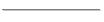

| [Home](home.md) | [Downloads](downloads.md) | [Examples](examples.md) | [Documentation](documentation.md) | [Sources](https://github.com/gammasoft71/delegates) | [Project](https://sourceforge.net/projects/delegates/) | [Gammasoft](https://gammasoft71.wixsite.com/gammasoft) | [Contact](contact.md) | [Website](https://gammasoft71.wixsite.com/delegates) |

# Status information

 Not applicable

 Not started

 Started

 In progress

 Usable

 Complete

# delegates :

| Name               | Type    | Status                                   |
|--------------------|---------|------------------------------------------|
| action             | typedef |  |
| delegate           | class   |  |
| func               | typedef |  |
| non_const_overload | struct  |  |
| const_overload     | struct  |  |
| overload           | struct  |  |
| predicate          | typedef |  |

# events :

| Name              | Type    | Status                                   |
|-------------------|---------|------------------------------------------|
| event             | class   |  |
| event_args        | class   |  |
| event_handler     | typedef |  |
  
______________________________________________________________________________________________

© 2021 Gammasoft.
