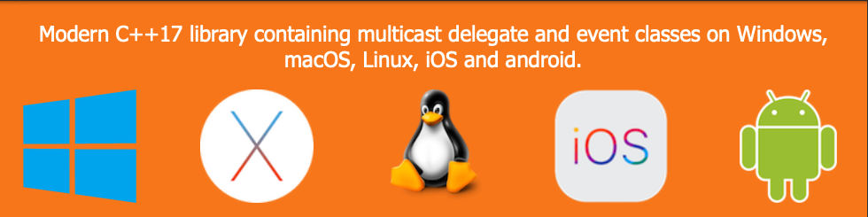

| [Home](home.md) | [Downloads](downloads.md) | [Examples](examples.md) | [Documentation](documentation.md) | [Sources](https://github.com/gammasoft71/delegates) | [Project](https://sourceforge.net/projects/delegates/) | [Gammasoft](https://gammasoft71.wixsite.com/gammasoft) | [Contact](contact.md) | [Website](https://gammasoft71.wixsite.com/delegates) |

# delegates

* Single and multicast delegate
* event, event_args and event_handler are base classes for eventing.
* action represents a delegate that has variable parameters and does not return a value.
* func represents a delegate that has variables parameters and returns a value of the type specified by the result_t type.
* predicate represents a delagate that defines a set of criteria and determines whether the specified object meets those criteria.
* overload represents class that use to determine one of const and non const overloaded methods.

______________________________________________________________________________________________

© 2021 Gammasoft.
